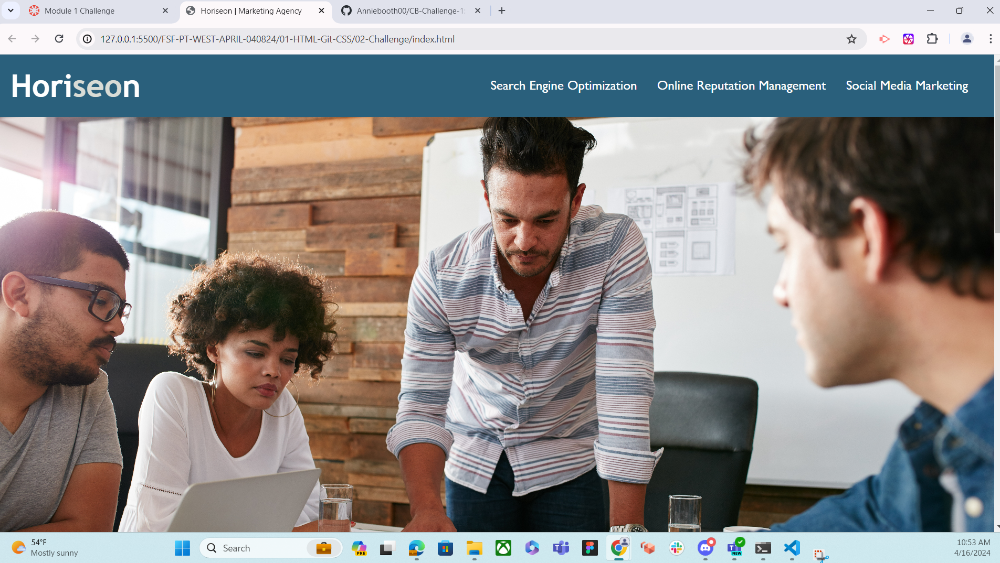
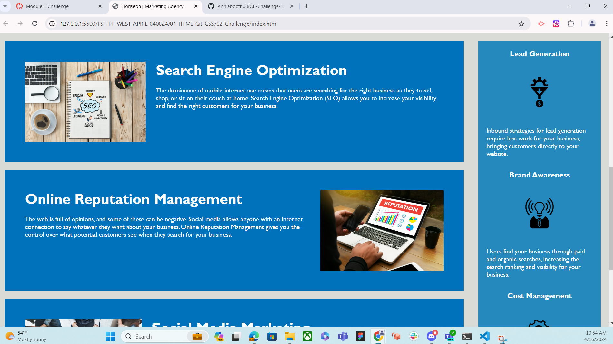
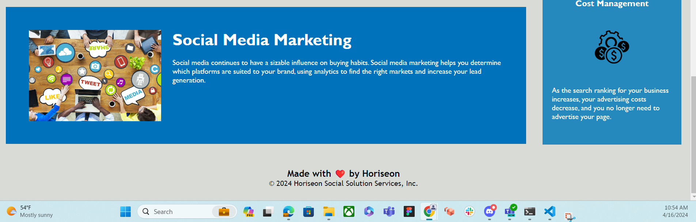

# CB-Challenge-1
Weekly challenge, on-the-job ticket.

Description:

This week's challenge is all about web accessibility. I was tasked with refactoring an existing site to make it more accessible. Why does it matter? Well, accessibility ensures that everyone, including people with disabilities, can use the website effectively. Plus, it's good for business – accessible sites rank better on search engines and help avoid potential legal issues.

My job is to tidy up the codebase, focusing on things like using semantic HTML elements, organizing the structure logically, and ensuring all images have descriptive alt attributes.

Challenge:

User Story--

As a marketing agency, I want a codebase that follows accessibility standards so that our site is optimized for search engines.

Acceptance Criteria--

The webpage should meet accessibility standards.
Semantic HTML elements should be used.
HTML elements should follow a logical structure independent of styling.
Image elements should have accessible alt attributes.
Heading attributes should fall in sequential order.
The title element should be concise and descriptive.

## Screenshots

## Deployed Application

[Link to Site](https://anniebooth00.github.io/CB-Challenge-1/)

## Usage

Is intended for the grader to assess the completion of the assignment.

## License

The project is licensed under MIT License.

## Credit

Original code from course curriculum.

## Contact 

For questions or feedback, feel free to contact me at anniebooth00@gmail.com

